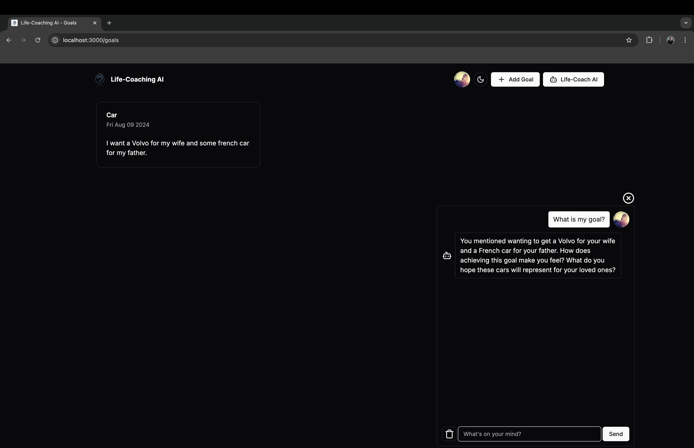

[](https://stand-with-ukraine.pp.ua)


# Life-Coaching AI (Web)

Welcome to the Life-Coaching AI App! This application is designed to help
users explore their potential and achieve their goals through personalized
guidance and insightful questions. The app is built using
[Next.js](https://nextjs.org/) bootstrapped with
[`create-next-app`](https://github.com/vercel/next.js/tree/canary/packages/create-next-app)
and is available on a web platform.

## Features

- **AI Chatbot**: An AI-powered life-coach that asks questions to help users
  find their own answers.
- **Goals Page**: Users can add and track their life goals, such as learning a
  new language, becoming a programmer, losing weight, or immigrating to Canada.
- **User Authentication**: Secure user authentication with customizable user
  profiles.
- **Theme Toggle**: Switch between light and dark themes.
- **Responsive Design**: Optimized for web and mobile screens.
- **Architectural pattern** :
  [Monolith](https://learn.microsoft.com/en-us/dotnet/architecture/modern-web-apps-azure/common-web-application-architectures#all-in-one-applications);
- **CI/CD**: [Vercel](https://vercel.com/features/previews) is used to
  deliver the new releases to the production environment after every push to the
  **master** branch;
- **Git Hosting Service**: [GitHub](https://github.com);
- **Version control system**: [Git](https://git-scm.com);
- [`next/font`](https://nextjs.org/docs/basic-features/font-optimization) to
  automatically optimize and load Inter, a custom Google Font.
- **Tailwind CSS**: A utility-first CSS framework for rapidly building custom
  designs.
- **Programming language**: [TypeScript](https://www.typescriptlang.org);
- [Backend](https://nextjs.org/docs/app/building-your-application/routing/route-handlers):
  Next.js Route Handlers allow you to create custom request handlers for a given
  route using the Web Request and Response APIs.
- **Code Readability:** code is easily readable with no unnecessary blank lines,
  no unused variables
  or methods, and no commented-out code, all variables, methods, and resource
  IDs are descriptively
  named such that another developer reading the code can easily understand their
  function.

## Data Storage and Caching

This app uses Pinecone and MongoDB with Prisma for data storage and caching.
Pinecone is used for efficient vector search and similarity search, while
MongoDB serves as the primary database for storing goals. Prisma acts as an
ORM (Object-Relational Mapping) tool to interact with MongoDB seamlessly.

- [Pinecone Documentation](https://docs.pinecone.io/home)
- [MongoDB Documentation](https://www.mongodb.com/docs/)
- [Prisma Documentation](https://www.prisma.io/docs/getting-started/quickstart)

## Getting Started

### Prerequisites

- Node.js (v14 or later)
- npm or yarn
- Basic understanding of Next.js and TypeScript concepts is recommended.

### Installation

- Clone the repository:

```bash
git clone https://github.com/Turskyi/nextjs-life-coaching-ai.git
cd nextjs-life-coaching-ai
```

- Install dependencies:

```bash
npm install
# or
yarn install
```

### Running the App locally

- Run the development server:

```bash
npm run dev
# or
yarn dev
# or
pnpm dev
# or
bun dev
```

- Open [http://localhost:3000](http://localhost:3000) with your browser to
   see the result.

### Building for Production

- Build the app for production:

```bash
npm run build
# or
yarn build
```

- Start the production server:

```bash
npm start
# or
yarn start
```

## Project Structure

```
src/
├── components
│   ├── AIChatBox.tsx
│   ├── AddEditGoalDialog.tsx
│   └── ThemeToggleButton.tsx
├── app
│   ├── goals/
│   └── layout.tsx
├── assets
│   ├── logo-no-bg.png
│   └── logo.png
├── .gitignore
├── next.config.mjs
├── package.json
├── constants.ts # Application-wide constants
└── README.md
```

## Contributing

Contributions are welcome! Please open an issue or submit a pull request for
any improvements or bug fixes.

## Contact:

For any questions or feedback, please feel free to create an issue in this
repository.

## Website:

Visit the [Life-Coaching AI](https://lifecoach.turskyi.com/) to experience the
interactive chatbot and explore your potential.

## Screenshot:

<!--suppress CheckImageSize -->


## Credits

This project is based on the
[Next.js 14 Custom Chatbot (OpenAI ChatGPT, Vercel AI SDK, Pinecone, Shadcn UI, TypeScript, Tailwind)](https://youtu.be/mkJbEP5GeRA?si=UBzGnGOKHgawNK1-)
by [Coding in Flow](https://github.com/codinginflow) YouTube channel.
All credit goes to the original author
[Florian Walther](https://github.com/florianwalther-private).
I only followed along and made some minor changes.
